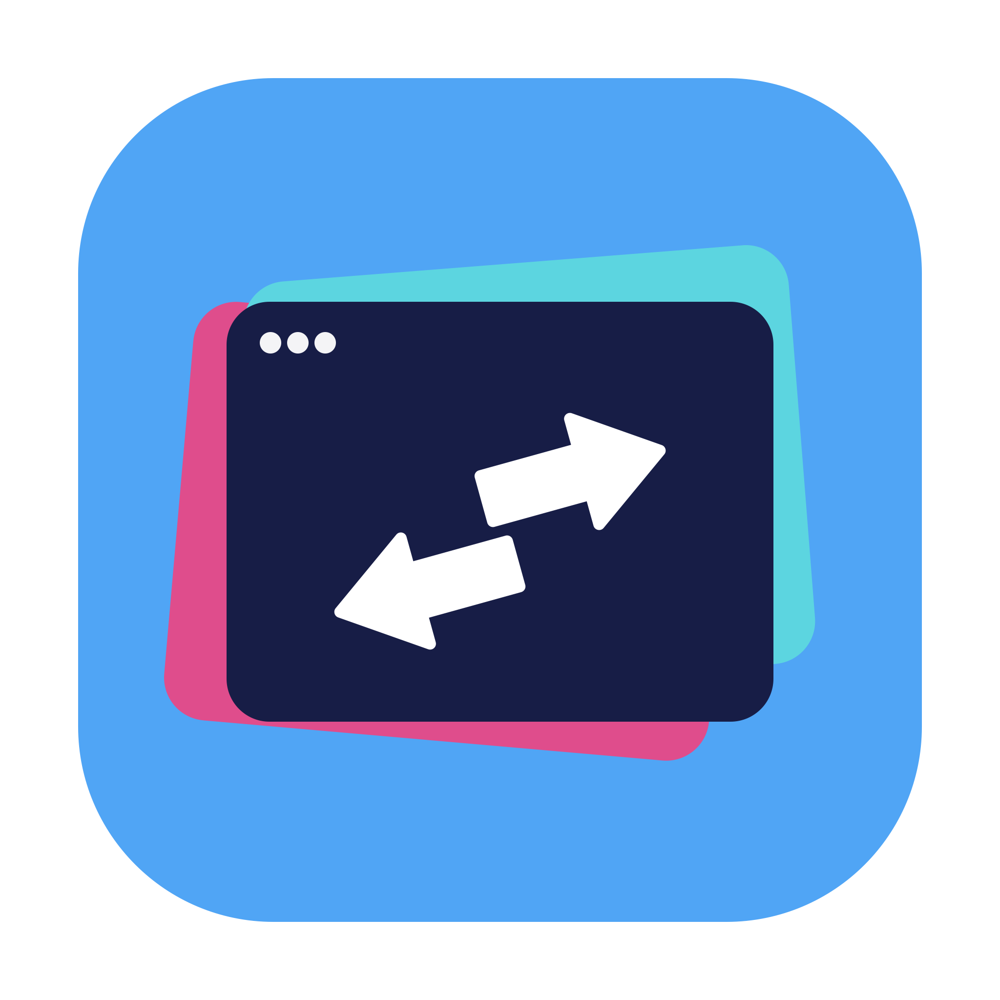

<p align="center">
  
</p>

<h1 align="center">Tabby</h1>

<p align="center">
  <b>A lightweight, blazing-fast window switcher for macOS with zero delay.</b>
</p>

<p align="center">
  <a href="https://github.com/Dinhbinh02/tabby/releases/latest"></a>
  <a href="https://github.com/Dinhbinh02/tabby/blob/main/LICENSE"></a>
  
  
</p>

---

## ✦ Features

- **⚡ Zero-Delay Activation:** Instant window listing and switching with native CoreGraphics event tapping.
- **🎨 Glassmorphic HUD:** Modern, liquid-smooth macOS Sonoma/Ventura aesthetic with live window thumbnails.
- **⌨️ Keyboard-Driven Navigation:**
  - `⌥ Tab` / `⌥ ⇧ Tab` to cycle forwards and backwards.
  - `1` – `9` for instant jump selection.
  - `Q` to quit an application directly.
  - `H` to hide an application.
  - Arrow keys (`←` `→` `↑` `↓`) & `Enter` / `Space` for full manual control.
- **⚙️ Deep Customization:**
  - Fully customizable activation shortcuts (single key or key combination).
  - Configurable UI scale (Compact, Medium, Large) and item limit (up to 10).
  - Excluded application blacklist.
  - Launch at Login support.
- **🔄 Built-in Auto Updater:** Seamless background check and in-app update installation directly from GitHub Releases.
- **🔒 Privacy & Lightweight:** Pure Swift, ad-free, zero tracking, memory footprint under 30MB.

---

## 📥 Installation

### 1. Direct Download
Download the latest `Tabby-vX.X.X.dmg` from the **[Releases Page](https://github.com/Dinhbinh02/tabby/releases/latest)**.

1. Open the `.dmg` file.
2. Drag **Tabby** into your **Applications** folder.
3. Launch Tabby.

> [!TIP]
> **First-time launch on macOS:**
> If macOS displays an unidentified developer prompt:
> - Right-click (or `Control` + click) `Tabby.app` in your Applications folder and select **Open**.
> - Or run in Terminal:
>   ```bash
>   xattr -cr /Applications/Tabby.app
>   ```

### 2. Permissions Required
Tabby requires the following macOS permissions to function:
- **Accessibility:** To monitor the global `Option + Tab` shortcut and switch between active windows.
- **Screen Recording:** To capture real-time window thumbnail previews in the switcher panel.

Tabby will guide you with a setup wizard on first launch.

---

## ⌨️ Shortcuts Reference

| Action | Shortcut |
| :--- | :--- |
| **Activate Switcher** | `⌥ Tab` (or configured shortcut) |
| **Next Window** | `Tab` / `→` / `↓` |
| **Previous Window** | `⇧ Tab` / `←` / `↑` |
| **Switch to Selected** | Release `⌥` or press `Enter` / `Space` |
| **Quick Jump (Index 1-9)** | `1`, `2`, `3`, ..., `9` |
| **Close Application** | `Q` |
| **Hide Application** | `H` |
| **Dismiss Switcher** | `Escape` |

---

## 🛠️ Building from Source

### Prerequisites
- macOS 13.0 Ventura or later
- Xcode 15+ / Command Line Tools (Swift 5.9+)

### Build & Run
```bash
# Clone the repository
git clone https://github.com/Dinhbinh02/tabby.git
cd tabby

# Build and assemble the standalone .app bundle
./bundle.sh

# Or create a distributable DMG package
./create_dmg.sh
```

---

## 📄 License

Tabby is released under the [MIT License](LICENSE).
